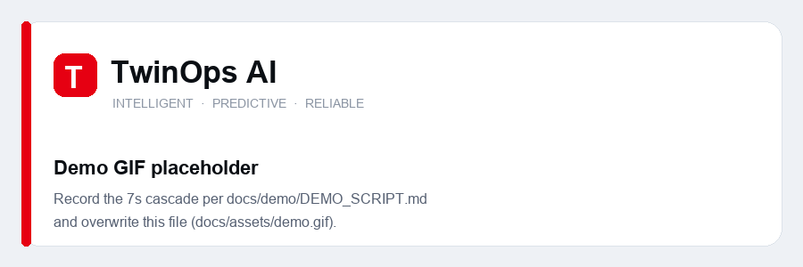

<div align="center">

# TwinOps AI

**Enterprise Infrastructure That Thinks Before It Breaks**

*A real-time Digital Twin of enterprise infrastructure with explainable, multi-agent AI operations — detection, root-cause analysis, prediction, and remediation guidance with evidence you can audit.*

`Status: 🚧 Active — all 8 surfaces live · Twin + Incidents + RCA working end-to-end` · [Roadmap](DEVELOPMENT_ROADMAP.md)

</div>

---

## What it is

Monitoring tools answer *"what happened?"*. TwinOps AI answers **why it happened, what happens next, what's affected, and what to do** — and shows its work.

- **Live Digital Twin** — an interactive dependency graph of servers, databases, APIs, queues, and services; every node health-tinted in real time, failures visibly cascading along dependency edges.
- **Explainable AI incident pipeline** — six cooperating agents (monitoring → investigation → knowledge → prediction → recommendation → reporting) produce a root cause with **evidence-weighted confidence**, cited runbooks, recommended actions, and an ETA. The confidence number is *computed from evidence, never hallucinated*.
- **Deterministic simulation engine** — a seeded, replayable simulation of a realistic enterprise topology (30–200 nodes) with 8 scripted failure scenarios drives the entire product. Same seed + same scenario = identical run: that one property powers reproducible demos, incident replay, and honest tests.
- **Knowledge Hub** — a searchable runbook library; the AI root cause links straight to the runbook that fixes each incident. (Keyword search today; semantic RAG is the next layer.)

## The demo moment



> Open the twin → inject a database connection-pool failure → watch the cascade ripple across the graph in amber and crimson → agents investigate live in a visible event stream → the AI names the root cause with 90%+ evidence-backed confidence and cites the runbook that fixes it → apply the action → watch recovery to emerald.

*Recording the GIF/video: see [docs/demo/DEMO_SCRIPT.md](docs/demo/DEMO_SCRIPT.md) — deterministic, ~10 min to capture.*

## Architecture at a glance

```
 Next.js 16 (light/dark)  ── REST + WebSocket ──  FastAPI modular monolith (Docker)
   twin · incidents ·          snapshot + delta      simulation · twin · incidents · agents
   dashboard · copilot                               knowledge · prediction · llm gateway
                                                          │ in-process event bus + ticker
                              LLM gateway → Ollama / Groq / Gemini / OpenRouter (OpenAI-compatible)
```

Deterministic core, LLMs at the edges. Full design, diagrams, and every decision's rationale: **[ARCHITECTURE.md](ARCHITECTURE.md)**.

## What's built

All eight surfaces are live and driven by real data:

- **Digital Twin** — interactive dependency graph, live health over WebSocket, inject-failure → visible cascade, click-for-detail, plus a **what-if blast-radius preview** (click a healthy node to see what its failure would take down).
- **Incidents** — auto-detected, with an **inferred** root cause (from topology + health, not hallucinated), evidence-weighted confidence, recommended actions, an **LLM explanation**, the linked runbook, **postmortem export**, and **replay on the twin**.
- **Dashboard** — global health, active incidents, and **predicted failures** ("likely critical in ~Ns").
- **AI Agents** — the six-agent pipeline visualized working the live incident.
- **Knowledge Hub** · **Infrastructure** · **Analytics** · **Settings** — searchable runbooks, live inventory, MTTR/frequency/severity, and provider + sim-seed config.
- **Copilot** — a floating assistant that answers from live state (LLM-backed, deterministic fallback) and navigates the app.

## Runs for $0

The entire MVP builds and runs free, offline, on one laptop — `docker compose up` brings up Postgres, Valkey, and Ollama; no paid API key is ever required to boot (paid providers activate automatically when a key exists). Details: [TECH_STACK.md](TECH_STACK.md).

**Getting started (zero API keys needed):**

```bash
git clone https://github.com/manas-vamsi/TwinOps-AI && cd TwinOps-AI
bash scripts/dev-setup.sh        # .env + postgres/valkey/ollama + deps  (Windows: .\scripts\dev-setup.ps1)
pnpm dev                         # web  → http://localhost:3000
cd apps/api && uv run uvicorn twinops.main:app --reload   # api → http://localhost:8000/healthz
```

Prereqs: Node 22+, pnpm, [uv](https://docs.astral.sh/uv/), Docker.

## Engineering

- **Deterministic core, LLM at the edges** — detection, cascade, root cause, and prediction are seeded and reproducible (instant, testable); the LLM only enriches on demand and **degrades gracefully** to deterministic output if a provider is missing or a call fails.
- **Snapshot + delta realtime** — REST snapshot, sequenced WebSocket deltas, seq-gap re-snapshot, backoff reconnect; one app-wide socket.
- **Single source of truth contracts** — Pydantic → OpenAPI → generated TypeScript types, enforced by a CI drift gate so frontend and backend can't diverge.
- **Security** — secrets server-side only (never bundled to the browser), per-IP rate limiting on mutating + LLM endpoints, prompt-injection-guarded LLM prompts, input validation at every boundary.
- **Tested** — 42 automated tests (pytest + vitest), strict typing (pyright + tsc), ruff + eslint, all run in GitHub Actions on every push.
- **$0, local-first** — one `docker compose up`; no paid API key required to run.

## Documentation

| Doc | What it owns |
|---|---|
| [PRODUCT_VISION.md](PRODUCT_VISION.md) | Why this exists, who it's for, brand & UX principles |
| [ARCHITECTURE.md](ARCHITECTURE.md) | The complete system design — the single source of truth |
| [DEVELOPMENT_ROADMAP.md](DEVELOPMENT_ROADMAP.md) | Phases P0–P5 with demoable exit criteria |
| [TECH_STACK.md](TECH_STACK.md) | Every technology, why it was chosen, what it costs ($0), when to revisit |
| [DEVELOPMENT_RULES.md](DEVELOPMENT_RULES.md) | The engineering rulebook every implementation follows |

## Design language

Fujitsu-aligned: **Fujitsu Red `#E60012`** accent, light theme by default (mirroring Fujitsu's own white-and-red web presence) with a premium dark theme one click away. Emerald for healthy, signal-red for critical. Manrope + Space Grotesk + JetBrains Mono. Inspired by Linear, Vercel, and Stripe, not Grafana. The interface should feel like an operating system for infrastructure, and everything should feel expensive.

---

<div align="center"><sub>Built by <a href="https://github.com/manas-vamsi">Manas</a> · TwinOps AI · Intelligent · Predictive · Reliable</sub></div>
